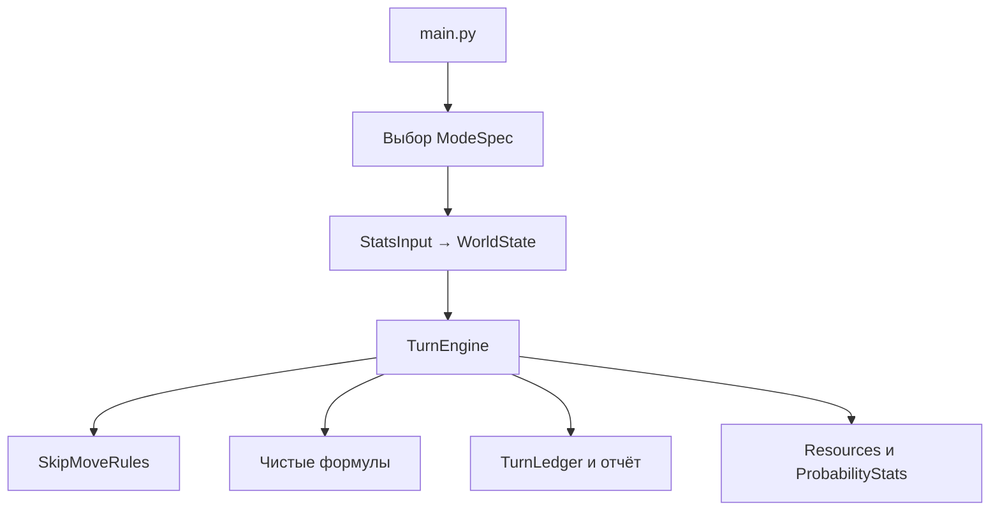

# Архитектура

В центре приложения находится один движок хода. Различия между мирами
представлены небольшими объектами правил, а формулы остаются обычными чистыми
функциями.

## Границы ответственности

- `modules/mode_spec.py` хранит явную таблицу режимов: классы статов и фабрику
  правил. Добавление мира не требует нового движка.
- `modules/run_start_skip.py` отвечает только за ввод и собирает `WorldState`.
- `modules/run_skip_move.py` задаёт порядок стадий одного хода и применяет
  результат к состоянию.
- `modules/skip_move_rules.py` содержит только различия между `basic`,
  `atterium` и `isf`.
- `functions/` содержит формулы без скрытого состояния и иерархий из классов
  со статическими методами.
- `stats/` содержит Pydantic-модели, ограничения входных данных, pretty-вывод
  и человекочитаемый промышленный codec.
- `TurnLedger` отделяет доходы, расходы и коэффициенты. Благодаря этому остаток
  казны считается как запас плюс чистый поток за ход.
- `UserIO` изолирует интерактивный ввод от движка и позволяет тестировать ход
  без терминала.
- `ResourceInventory` хранит зарегистрированные ресурсы и содержимое складов,
  а `collect`/`spend` обеспечивают неотрицательность и сообщают дефицит.
  Неизвестные объёмы природных месторождений движок не моделирует.
- `ProbabilityStats` содержит операционные коэффициенты и информационные
  вероятности крупных событий. Движок никогда не применяет крупный ивент
  автоматически.

## Порядок расчёта хода

1. Обновляются рабочая сила и операционные вероятности.
2. Рассчитываются логистика и общие вспомогательные коэффициенты.
3. Обновляются сельское хозяйство, продовольствие и население.
4. Шестью месячными подшагами обновляются ресурсы и износ оборудования.
5. Выполняются многoходовые производственные правила и потребление ресурсов.
6. Обновляются промышленность, налоги и торговля.
7. Доходы и расходы сводятся в `TurnLedger`.
8. Обновляются казна, стабильность, образование и военное оснащение.
9. Рассчитываются вероятности крупных событий за полугодие.
10. При отрицательной казне интерфейс может предложить кредит.

Случайность передаётся в `TurnEngine` как NumPy `Generator`. Это делает
операционные коэффициенты и голодные смерти воспроизводимыми в тестах.

## Как расширять

Новую общую механику следует добавлять как функцию в подходящий модуль
`functions/`, вызывать из нужной стадии `TurnEngine` и закреплять инвариантом.
Если различается только правило конкретного мира, оно добавляется в
`SkipMoveRules`. Новая стратегия нужна лишь тогда, когда поведение мира
действительно отличается.
