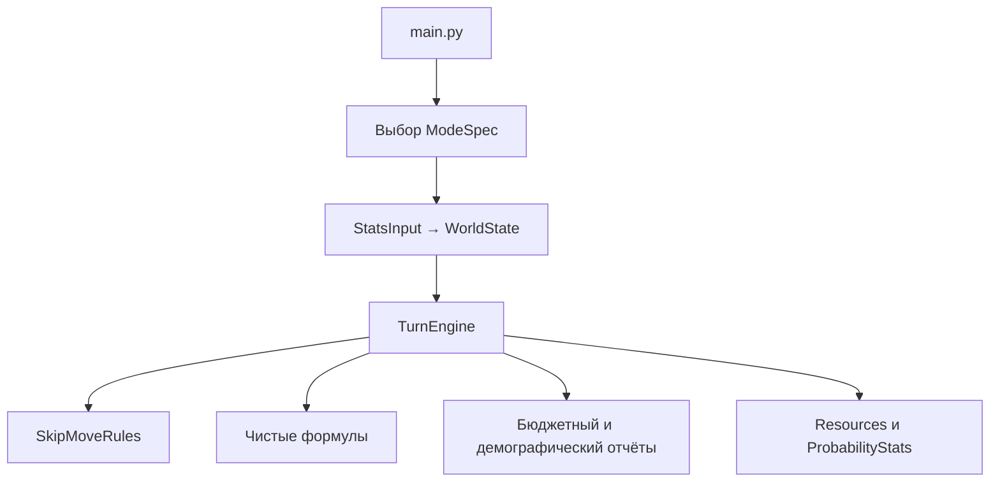

# Архитектура

В центре приложения находится один движок хода. Различия между мирами
представлены небольшими объектами правил, а формулы остаются обычными чистыми
функциями.

```mermaid
flowchart TD
    A["main.py"] --> B["Выбор ModeSpec"]
    B --> C["StatsInput → WorldState"]
    C --> D["TurnEngine"]
    D --> E["SkipMoveRules"]
    D --> F["Чистые формулы"]
    D --> G["Бюджетный и демографический отчёты"]
    D --> H["Resources и ProbabilityStats"]
```

## Границы ответственности

- `modules/mode_spec.py` хранит явную таблицу режимов: классы статов и фабрику
  правил. Добавление мира не требует нового движка.
- `modules/run_start_skip.py` отвечает только за ввод и собирает `WorldState`.
- `modules/run_skip_move.py` задаёт порядок стадий одного хода и применяет
  результат к состоянию.
- `modules/skip_move_rules.py` содержит только различия между `basic`,
  `atterium` и `isf`.
- `functions/` содержит формулы без скрытого состояния и иерархий из классов
  со статическими методами.
- `stats/` содержит Pydantic-модели, ограничения входных данных, pretty-вывод
  и отдельные TOML-codec промышленности и торговли с импортом прежнего YAML
  v2 для промышленности. Формулы эффектов разбираются безопасным AST без
  `eval`.
- `TurnLedger` отделяет доходы, расходы и коэффициенты. Благодаря этому остаток
  казны считается как запас плюс чистый поток за ход.
- `PopulationGrowthBreakdown` сохраняет базовый прирост, ресурсную поправку,
  каждый демографический коэффициент, убыль и смерти от недоедания.
- `TurnCalendar` в `functions/time_models.py` является единственным источником
  длительности хода. `TURN_MONTHS` задаёт календарь, а шестимесячные нормы
  автоматически переводятся в поток текущего хода.
- `UserIO` изолирует интерактивный ввод от движка и позволяет тестировать ход
  без терминала.
- `ResourceInventory` хранит зарегистрированные ресурсы и содержимое складов,
  а `collect`/`spend` обеспечивают неотрицательность и сообщают дефицит.
  Неизвестные объёмы природных месторождений движок не моделирует.
- `ProbabilityStats` содержит операционные коэффициенты и информационные
  вероятности крупных событий. Движок никогда не применяет крупный ивент
  автоматически.

## Порядок расчёта хода

1. Обновляются рабочая сила и операционные вероятности.
2. Рассчитываются логистика и общие вспомогательные коэффициенты.
3. Обновляются сельское хозяйство и продовольствие.
4. Настроенный импорт поступает на склады.
5. Ресурсы добываются месячными подшагами по числу месяцев текущего хода.
6. Выполняются многoходовые производственные правила и потребление ресурсов.
7. Применяются ресурсные эффекты, после чего обновляется население.
8. Обновляются промышленность, налоги, курс и общая торговля; настроенный
   экспорт забирает только остатки ресурсов.
9. Доходы, расходы и денежный баланс сделок сводятся в `TurnLedger`.
10. Обновляются казна, образование и военное оснащение; расчётная стабильность
   влияет на ход, но исходная стата стабильности восстанавливается.
11. Рассчитываются вероятности крупных событий за длительность хода.
12. При отрицательной казне интерфейс может предложить кредит.

Случайность передаётся в `TurnEngine` как NumPy `Generator`. Это делает
операционные коэффициенты и голодные смерти воспроизводимыми в тестах.

## Как расширять

Новую общую механику следует добавлять как функцию в подходящий модуль
`functions/`, вызывать из нужной стадии `TurnEngine` и закреплять инвариантом.
Если различается только правило конкретного мира, оно добавляется в
`SkipMoveRules`. Новая стратегия нужна лишь тогда, когда поведение мира
действительно отличается.

Новый материал не требует изменения кода: страна регистрирует произвольный
alias, имя и одну из фиксированных групп в TOML. Цель эффекта может ссылаться
на любую числовую стату; движок безопасно разрешает её по Pydantic-модели и
выбирает этап применения. Неоднозначные имена уточняются именем раздела.
